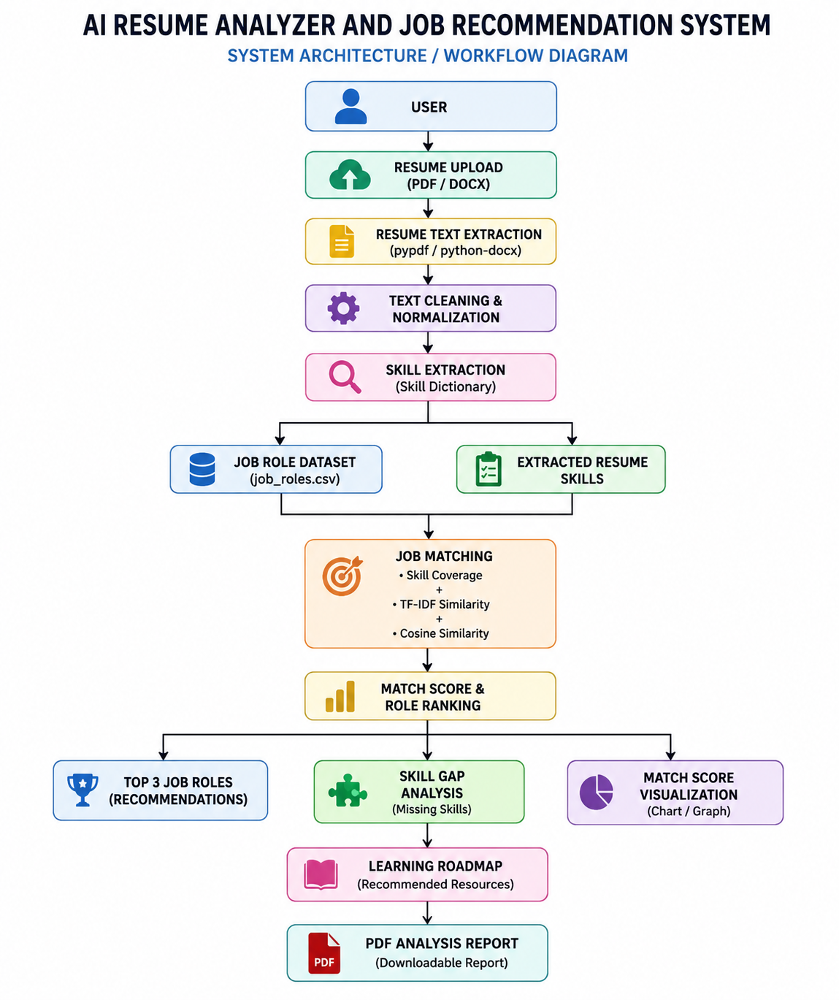

# AI Resume Analyzer and Job Recommendation System

## 📌 Project Overview

The **AI Resume Analyzer and Job Recommendation System** is an NLP-based application that analyzes a candidate's resume and compares it with predefined job-role requirements.

The system extracts resume text, identifies technical skills, calculates job-role match scores, recommends suitable roles, identifies missing skills, and generates a personalized learning roadmap.

The application provides an interactive Streamlit dashboard and allows users to download their analysis as a PDF report.

---

## 🎯 Project Objective

The main objective of this project is to help students understand how well their resume matches different technical job roles.

The system focuses on:

- Technical skills
- Projects
- Education
- Relevant experience
- Job-role requirements

The generated match score is an educational estimate and should not be considered an automatic hiring or rejection decision.

---

## ❗ Problem Statement

Students often do not know whether their resumes contain the skills expected for a particular job role.

This project provides a simple system that analyzes resume content and compares it with predefined job-role requirements.

It helps users:

- Understand suitable job roles
- Identify existing skills
- Find missing skills
- Understand skill gaps
- Follow a personalized learning roadmap

---

## ✨ Key Features

- 📄 Upload PDF and DOCX resumes
- 🔍 Extract resume text
- 🧹 Clean and normalize resume text
- 🧠 Identify technical skills
- 💼 Compare resumes with multiple job roles
- 📊 Calculate job-role match scores
- 🏆 Recommend the top three suitable roles
- ⚠️ Identify missing skills
- 📚 Generate personalized learning roadmaps
- 📈 Display match-score visualizations
- 📥 Download analysis as a PDF report
- 🌐 Interactive Streamlit interface

---

## 🔄 Project Workflow

```text
Upload Resume
      ↓
Extract Resume Text
      ↓
Clean and Normalize Text
      ↓
Extract Technical Skills
      ↓
Load Job-Role Requirements
      ↓
Calculate Skill Coverage
      ↓
Calculate TF-IDF Similarity
      ↓
Calculate Final Match Score
      ↓
Rank Job Roles
      ↓
Recommend Top 3 Roles
      ↓
Analyze Skill Gaps
      ↓
Generate Learning Roadmap
      ↓
Display Results
      ↓
Download PDF Report

---

## 🛠️ Technologies Used

### 💻 Programming Language
- Python

### 📄 Resume Processing
- pypdf
- python-docx

### 📊 Data Processing
- Pandas
- NumPy

### 🧠 NLP and Matching
- Scikit-learn
- TF-IDF
- Cosine Similarity
- Keyword-based Skill Extraction

### 📈 Visualization
- Plotly

### 🖥️ User Interface
- Streamlit

### 📑 Report Generation
- ReportLab

---

## 💼 Supported Job Roles

The system currently supports the following job roles:

1. Data Analyst
2. Data Scientist
3. Python Developer
4. Full Stack Developer
5. Machine Learning Engineer
6. AI Engineer
7. NLP Engineer
8. Computer Vision Engineer

Job-role requirements are stored in:

`data/job_roles.csv`

---

## 🧠 Skill Extraction

The system uses a controlled skill dictionary to identify technical skills present in the resume.

Skills are grouped into categories such as:

- Programming
- Databases
- Machine Learning
- Deep Learning
- Computer Vision
- Web Development
- Tools

The skill dictionary is stored in:

`data/skill_dictionary.csv`

---

## 📊 Job Matching Method

The system uses two main components to calculate the final match score.

### 1. Skill Coverage

Skill coverage measures how many of the required skills for a job role are found in the resume.

**Formula:**

`Skill Coverage = Matched Required Skills / Total Required Skills × 100`

### 2. TF-IDF Similarity

TF-IDF converts the resume and job description into numerical vectors.

Cosine similarity is then used to measure the similarity between the two text representations.

### 3. Final Match Score

The final score uses a weighted combination:

**Final Match Score = 70% Skill Coverage + 30% TF-IDF Similarity**

The job roles are then ranked from highest to lowest match score.

---

## ⚠️ Skill-Gap Analysis

After selecting a target job role, the system compares the skills found in the resume with the required skills for the selected role.

The system displays:

- ✅ Skills already found in the resume
- ⚠️ Missing or not detected skills

This helps the user understand which skills may require further learning.

---

## 📚 Personalized Learning Roadmap

For detected skill gaps, the system generates a basic learning roadmap.

### Example

- **Week 1:** Machine Learning Fundamentals
- **Week 2:** Scikit-learn
- **Week 3:** PyTorch
- **Week 4:** FastAPI
- **Week 5:** Docker Fundamentals

The roadmap is rule-based and depends on the missing skills identified for the selected role.

---

## 🖥️ Streamlit Dashboard

The application provides an interactive dashboard containing:

- 📄 Resume upload
- 📝 Extracted resume text
- 🧠 Detected technical skills
- 💼 Recommended job roles
- 📊 Match scores
- 🎯 Target-role selection
- ✅ Skills found
- ⚠️ Missing skills
- 📚 Learning roadmap
- 📈 Match-score chart
- 📥 PDF report download

---

## 📥 PDF Analysis Report

Users can download a PDF report containing:

- Resume file name
- Detected skills
- Recommended job roles
- Match scores
- Selected target role
- Skills found
- Missing skills
- Learning roadmap
- Responsible-AI disclaimer

---

## 🧪 Testing and Evaluation

The application was tested using five fictional sample resumes representing different technical job roles.

### Test Results

| Test | Resume Type | Expected Role | Actual Role | Match Score | Result |
|---|---|---|---|---:|---|
| 1 | Data Analyst | Data Analyst | Data Analyst | 66.61% | ✅ PASS |
| 2 | Machine Learning | Machine Learning Engineer | Machine Learning Engineer | 84.33% | ✅ PASS |
| 3 | NLP | NLP Engineer | NLP Engineer | 79.94% | ✅ PASS |
| 4 | Full Stack | Full Stack Developer | Full Stack Developer | 78.70% | ✅ PASS |
| 5 | AI Engineer | AI Engineer | AI Engineer | 71.45% | ✅ PASS |

**Result: 5 out of 5 functional role-matching tests passed.**

> These tests are functional validation using controlled sample resumes. They do not represent real-world hiring accuracy.

---

## 🛡️ Responsible AI

This project is designed as an educational resume-analysis tool.

The system:

- Does not make hiring or rejection decisions.
- Does not evaluate protected personal information.
- Focuses on job-related skills and experience.
- Treats match scores as estimates.
- Does not assume that a missing keyword means a candidate lacks  the actual ability.
- Uses fictional sample resumes for testing.


---

## 📁 Project Structure

```text
ai_resume_analyzer/
│
├── app.py
├── resume_parser.py
├── text_cleaner.py
├── skill_extractor.py
├── job_matcher.py
├── roadmap_generator.py
├── requirements.txt
├── README.md
├── .gitignore
│
├── data/
│   ├── job_roles.csv
│   └── skill_dictionary.csv
│
├── sample_resumes/
│   ├── resume_data_analyst.pdf
│   ├── resume_ml_engineer.pdf
│   ├── resume_nlp_engineer.pdf
│   ├── resume_full_stack.pdf
│   └── resume_ai_engineer.pdf
│
├── reports/
│
└── tests/

---

## ⚙️ Installation

### 1. Clone the Repository

```bash
git clone <YOUR_GITHUB_REPOSITORY_URL>
cd ai_resume_analyzer

### 2. Create a virtual environment
python -m venv venv

### 3. Activate the virtual environment
Windows PowerShell
.\venv\Scripts\Activate.ps1

### 4. Install dependencies
pip install -r requirements.txt

---

## ▶️ Running the Application

Start the Streamlit application using:

```bash
streamlit run app.py

The application will open in the browser.

---

## 📌 Usage

1. Open the Streamlit application.
2. Upload a PDF or DOCX resume.
3. View the extracted resume information.
4. Review detected technical skills.
5. View recommended job roles.
6. Select a target job role.
7. Review skills found and missing skills.
8. View the personalized learning roadmap.
9. Download the PDF analysis report.


---

## 🚀 Future Enhancements

Possible improvements include:

- Semantic matching using Sentence Transformers
- Improved NLP-based skill extraction
- Job-description upload
- Resume section detection
- Resume improvement suggestions
- LLM-powered feedback
- FastAPI backend
- Docker deployment
- Database support
- User authentication
- Cloud deployment
- Larger and more diverse evaluation datasets

---

## 👩‍💻 Project Type

**Student Project / NLP / Machine Learning / Career Guidance Application**

---

## 🧪 Testing

The application was tested using multiple anonymized sample resumes covering different job roles.

Testing included:

- PDF resume upload
- DOCX resume upload
- Resume text extraction
- Skill extraction
- Job-role recommendation
- Match-score calculation
- Skill-gap analysis
- Learning roadmap generation
- Match-score visualization
- PDF report generation
- Invalid file handling

The detailed testing sheet is available in:

`tests/testing_sheet.csv`

---

## 🏗️ System Architecture

The project workflow is represented in the architecture diagram below.



---

## 🚀 Live Demo

The application is deployed using Streamlit.

**Live Application:**  
https://ai-resume-analyzer-bkukrmjraegv6ppmehrrjc.streamlit.app/

---

## 🎥 Project Demonstration

A short demonstration video showing the working application, resume analysis, job-role recommendations, skill-gap analysis, learning roadmap, and report download is available below.

**Demo Video:**  
[Watch the Project Demonstration]
https://drive.google.com/file/d/1Rdg4kAE24vT7x2R5Dn4mcryKPWTJbedC/view?usp=sharing


---

## 📌 Disclaimer

This application is designed for educational and career-guidance purposes.

Match scores are estimates based on job-related skills and text similarity. They should not be used as automatic hiring or rejection decisions.

Missing keywords do not necessarily mean that a candidate lacks the underlying ability.

The system focuses on job-related information such as skills, projects, education, and relevant experience.